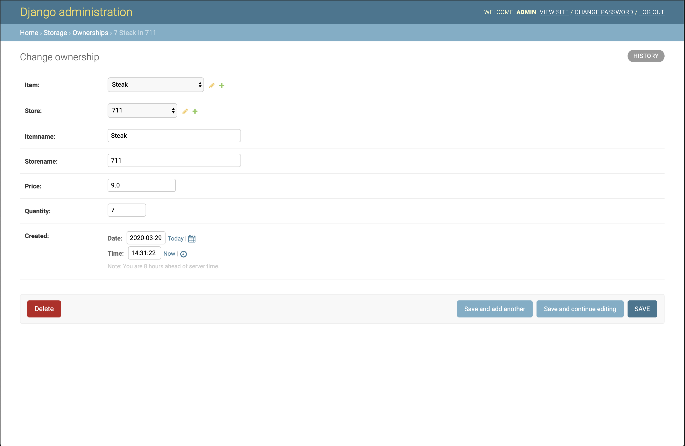

# La-Hacks

## How to run our website

### Install python3.7 and Django version 2.2

pip install django==2.2

### clone the repo and `cd` into `virtual_shelf` directory
clone https://github.com/AllenLiuX/La-Hacks.git

cd La-Hacks/virtual_shelf

### run `python3 manage.py runserver` to start the server

python3 manage.py runserver

### Go to http://127.0.0.1:8000/storage/storage-search/ on browser to open our front page.

### Go to http://127.0.0.1:8000/admin/ on browser to open the Django Administration for database.

## Inspiration
The outbreak of coronavirus (COVID-19) has significantly influenced the wellbeing of people and imposed great challenges on societies. The empty shelves at supermarkets are one of the most essential problems. People feel panic buying daily supplies; meanwhile, lots of us are frustrated after waiting for hours and finding out that the good we want just went out of stock.

Therefore, our project, Virtual Shelf, aims to keep track of the inventory of supermarkets (e.g. target, ralphs…). We want to update the stock every day (especially for certain goods in shortage, such as sanitizers and toilet paper)  so that people could be more informed about current situations. Therefore, we hope that with the help of Virtual Shelf, everyone can minimize the time spent on travelling among stores and stay safe & healthy :)

## What it does
On the customer side, one can search a particular store with specific items (we have two separate search bars to do this), and our database will return the matched supermarkets with price, quantity, and post time labeled for those items in reverse chronological order. Or if you just type in the name of the item that you are looking for / the store that you plan to visit, you can find out the result as well. Moreover, the returned stores will be displayed on our real-time google map if the user clicks on it, so one could see locations of markets compared with his/her own one and decide which store to go to. 

On the store owner's side, he/she can load price, quantity, and store name to our database through our “POST” interface. The data passed in will be automatically stored in our database and will be displayed once a customer requests such information.

User can also upload information that they saw in the stores and people can work together as a community to help each other.

## How I built it
Python as backend: we used Django as our website framework, designed and set up the database using python within the Django framework. We also incorporated Google Maps API to search and display locations on map.

Html, CSS, Javascript as frontend: we designed the multi-level webpages using HTML. We built the autocomplete function for the search bars using Javascript.

## Challenges I ran into
- Design many-to-many database structure that can support all our features
- Django model migration
- Implement search-autocomplete that can fetch data from our database
- Learn Django and Google Maps API from scratch

## Accomplishments that I'm proud of
Construct a multi-class database

Elegant interface & design

Incorporate Google Map API & label searched results on it

## What I learned
Cooperation remotely through git and voice chat

Nice experience with teammates

Skills like: Django, Javascript, API

## What's next for Virtual Shelf
In the future, we want to add more fancy features to our Virtual Shelf. 

First, when displaying the search result, we want to sort stores by their shortest distances to our current location, so it is clear for users to visualize and compare markets. 

Second, we want to incorporate a real-time update database if we can cooperate with some stores, so that users could have up-to-date information every time they check our website. Besides, we want to maintain a community on our website that everyone both get and voluntarily post storage information after login in. 

Moreover, we intend to embellish our interface and make better UI designs, such as adding shadows and animations. We also want to make an app that does the same job as our website, so that users could access our database by their mobile phones.

